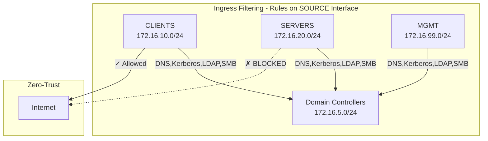

## Goal

Replace the permissive `Trusted_Lab_Networks` "allow any" firewall rules with granular, service-specific port rules on OPNsense. This project teaches network protocols by requiring you to understand exactly which ports each service needs to function.

Rules are organized by **source interface** (ingress filtering model) - you define what each VLAN's devices are allowed to access, not what can reach them.

---

## Background

### Why Harden Firewall Rules?

The permissive rules from Project 11 were intentional - they simplified initial setup and allowed us to focus on services without debugging firewall issues. However, they have significant drawbacks:

| Permissive Rules | Granular Rules |
|:-----------------|:---------------|
| `Protocol: any` - no learning | Explicit ports - understand protocols |
| Any compromised host can reach any service | Lateral movement restricted |
| No visibility into traffic patterns | Firewall logs show service usage |
| "It works but I don't know why" | "I know exactly what's allowed" |

### The OPNsense Ingress Filtering Model

> [!IMPORTANT]
> **OPNsense (and pf) filters traffic where it ENTERS the firewall, not where it exits.**
>
> This is called "ingress filtering" and is critical to understand before writing rules.

**Traffic flow example - Workstation to Domain Controller:**

```
1. Workstation (172.16.10.50) sends DNS query to DC (172.16.5.10)
2. Packet enters OPNsense via CLIENTS interface  <-- Rules evaluated HERE
3. OPNsense routes packet to INFRA interface
4. Packet exits to DC
```

**The rule belongs on CLIENTS (where traffic enters), NOT on INFRA (the destination).**

| Traffic Flow | Enters Via | Rule Location |
|:-------------|:-----------|:--------------|
| Workstation -> DC | CLIENTS | CLIENTS interface |
| Server -> DC | SERVERS | SERVERS interface |
| DC -> DC (same site) | INFRA | INFRA interface |
| DC -> DC (cross-site) | IPsec | IPsec interface |
| Road Warrior -> Royal Server | WireGuard | WireGuard interface |

### Why This Matters

If you place a rule on the INFRA interface with `Source: CLIENTS net`, it will **never match**. Traffic from CLIENTS enters via the CLIENTS interface, not INFRA. The INFRA interface only sees traffic **originating from** the INFRA VLAN (i.e., from the DCs themselves).

### The DRY Principle: Interface Groups

Instead of writing the same "Allow DNS to DCs" rule on every VLAN interface (CLIENTS, SERVERS, MGMT, WireGuard), we use **Interface Groups** to write it once.

| Without Groups | With Groups |
|:---------------|:------------|
| 4 interfaces x 11 AD rules = 44 rules | 1 group x 11 rules = 11 rules |
| Change DNS server? Update 4 places | Change DNS server? Update 1 place |
| Easy to miss one interface | Consistent across all VLANs |

### Visual Overview



### Firewall Policy Matrix

| Source ↓ / Dest → | INFRA (DCs) | CLIENTS | SERVERS | MGMT | Internet |
|:------------------|:-----------:|:-------:|:-------:|:----:|:--------:|
| **CLIENTS**       | AD Services | -       | KMS,PKI,WDS | ✗ | ✓ |
| **SERVERS**       | AD Services | -       | -       | -    | ✗ (Zero-Trust) |
| **MGMT**          | AD Services | RDP,SSH | RDP,SSH | -    | ✓ |
| **INFRA (DCs)**   | Replication | Response| -       | -    | Updates,DNS |
| **WireGuard**     | DNS only    | ✗       | ✗       | ✓    | ✗ |
| **IPsec**         | AD Repl     | ✓       | ✓       | ✓    | - |

> [!TIP]
> For the full visual diagram, see `diagrams/firewall-diagram.drawio` (open with draw.io or VS Code Draw.io extension).

---

## Prerequisites

- All services from Projects 1-17 operational
- Console access to VMs via Proxmox/Hyper-V (in case of lockout)
- WireGuard road warrior VPN working (Project 9)
- IPsec site-to-site VPN working (Project 17)
- Current OPNsense configuration backed up

> [!WARNING]
> **Before starting, back up your OPNsense configuration:**
> System > Configuration > Backups > Download

---

## Alias Definitions

Create all aliases first. This makes rules readable and maintainable.

### A. Port Aliases

**On both OPNsense firewalls:**

Navigate to **Firewall > Aliases** and create:

| Name | Type | Content | Description |
|:-----|:-----|:--------|:------------|
| SVC_DNS | Port(s) | 53 | DNS queries and zone transfers |
| SVC_Kerberos | Port(s) | 88, 464 | Kerberos auth and password change |
| SVC_LDAP | Port(s) | 389 | LDAP directory queries |
| SVC_LDAPS | Port(s) | 636 | LDAP over SSL |
| SVC_GlobalCatalog | Port(s) | 3268, 3269 | Global Catalog (plain and SSL) |
| SVC_SMB | Port(s) | 445 | SMB (SYSVOL, NETLOGON, shares) |
| SVC_RPC | Port(s) | 135 | RPC Endpoint Mapper |
| SVC_RPC_Dynamic | Port(s) | 49152:65535 | RPC Dynamic Ports |
| SVC_NTP | Port(s) | 123 | Network Time Protocol |
| SVC_ADWS | Port(s) | 9389 | AD Web Services (PowerShell) |
| SVC_DHCP_Server | Port(s) | 67 | DHCP server port |
| SVC_KMS | Port(s) | 1688 | Key Management Service |
| SVC_PKI_HTTP | Port(s) | 80 | PKI CRL/AIA distribution |
| SVC_PKI_HTTPS | Port(s) | 443 | PKI Web Enrollment |
| SVC_RADIUS | Port(s) | 1812, 1813 | RADIUS auth and accounting (see note below) |
| SVC_TFTP | Port(s) | 69 | TFTP for WDS/PXE |
| SVC_PXE | Port(s) | 4011 | PXE alternate port |
| SVC_RoyalServer | Port(s) | 54899 | Royal Server endpoint |
| SVC_SSH | Port(s) | 22 | SSH |
| SVC_RDP | Port(s) | 3389 | Remote Desktop |
| SVC_WinRM | Port(s) | 5985, 5986 | WinRM HTTP/HTTPS |

> **Why NTP (port 123) is critical for AD:** Kerberos authentication requires all computers to be within 5 minutes of each other (time skew tolerance). If NTP traffic is blocked, clocks drift apart, and authentication fails with cryptic "access denied" errors. Domain members sync time from DCs, and DCs sync from OPNsense (configured in Project 8).

> **Why no RADIUS rules in this project?** The `SVC_RADIUS` alias is defined for documentation completeness, but no firewall rule is needed. RADIUS traffic (Project 14) flows from OPNsense itself to the NPS server — the firewall is the RADIUS *client*. Traffic originating from OPNsense (self-originated traffic) is not subject to interface-based filtering rules. It exits directly via the appropriate interface without matching ingress rules.

> [!TIP]
> For port ranges, use colon syntax: `49152:65535`

### B. Host Aliases

| Name | Type | Content | Description |
|:-----|:-----|:--------|:------------|
| DC_HQ | Host(s) | 172.16.5.10 | P-WIN-DC1 |
| DC_Branch | Host(s) | 172.17.5.10 | H-WIN-DC2 |
| DCs_All | Host(s) | 172.16.5.10, 172.17.5.10 | All Domain Controllers |
| GW_HQ | Host(s) | 172.16.5.1 | OPNsenseHQ INFRA gateway |
| GW_Branch | Host(s) | 172.17.5.1 | OPNsenseBranch INFRA gateway |
| SRV_KMS | Host(s) | 172.16.20.12 | P-WIN-SRV2 (KMS) |
| SRV_PKI | Host(s) | 172.16.20.13 | P-WIN-SRV3 (Enterprise CA) |
| SRV_NPS_WDS | Host(s) | 172.16.20.14 | P-WIN-SRV4 (NPS/WDS) |
| SRV_Royal | Host(s) | 172.16.99.11 | P-WIN-SRV1 (Royal Server) |

### C. Network Aliases

| Name | Type | Content | Description |
|:-----|:-----|:--------|:------------|
| NET_All_Internal | Network(s) | 172.16.5.0/24, 172.16.10.0/24, 172.16.20.0/24, 172.16.99.0/24, 172.17.5.0/24, 172.17.10.0/24, 172.17.20.0/24, 172.17.99.0/24, 10.200.0.0/24 | All trusted networks |
| NET_HQ_All | Network(s) | 172.16.5.0/24, 172.16.10.0/24, 172.16.20.0/24, 172.16.99.0/24 | All HQ VLANs |
| NET_Branch_All | Network(s) | 172.17.5.0/24, 172.17.10.0/24, 172.17.20.0/24, 172.17.99.0/24 | All Branch VLANs |
| NET_WG_Peers | Network(s) | 10.200.0.0/24 | WireGuard road warriors |

Click **Save** after creating all aliases, then **Apply Changes**.

---

## Phase 0: WAN & VPN Interface Rules (Preserve Existing)

These rules already exist from previous projects. **Do NOT modify them** during hardening.

### A. WAN Interface Rules

Navigate to **Firewall > Rules > WAN**

Verify these rules exist:

**Rule 1 - WireGuard VPN:**

| Setting | Value |
|:--------|:------|
| Action | Pass |
| Protocol | UDP |
| Source | any |
| Destination | WAN address |
| Destination port | 51820 |
| Description | WireGuard VPN endpoint (Projects 7, 9) |

**Rule 2 - IPsec IKE:**

| Setting | Value |
|:--------|:------|
| Action | Pass |
| Protocol | UDP |
| Source | 192.168.1.245 (on HQ) / 192.168.1.240 (on Branch) |
| Destination | WAN address |
| Destination port | 500 |
| Description | IPsec IKE negotiation (Project 17) |

**Rule 3 - IPsec NAT-T:**

| Setting | Value |
|:--------|:------|
| Action | Pass |
| Protocol | UDP |
| Source | 192.168.1.245 (on HQ) / 192.168.1.240 (on Branch) |
| Destination | WAN address |
| Destination port | 4500 |
| Description | IPsec NAT Traversal (Project 17) |

**Rule 4 - IPsec ESP:**

| Setting | Value |
|:--------|:------|
| Action | Pass |
| Protocol | ESP |
| Source | 192.168.1.245 (on HQ) / 192.168.1.240 (on Branch) |
| Destination | WAN address |
| Description | IPsec encrypted payload (Project 17) |

> [!NOTE]
> **WAN IP Reference:**
> - HQ (Proxmox): 192.168.1.240
> - Branch (Hyper-V): 192.168.1.245

### B. WireGuard Interface Rules

Navigate to **Firewall > Rules > WireGuard** (or OPT1)

**Current rule (from Project 9):**

| Setting | Value |
|:--------|:------|
| Action | Pass |
| Protocol | any |
| Source | WireGuard net |
| Destination | NET_All_Internal |
| Description | Allow WireGuard peers to internal networks |

> [!NOTE]
> This will be tightened in Phase 6 to restrict road warriors to MGMT VLAN only.

### C. IPsec Interface Rules

Navigate to **Firewall > Rules > IPsec**

**Current rule (from Project 17):**

| Setting | Value |
|:--------|:------|
| Action | Pass |
| Protocol | any |
| Source | NET_All_Internal |
| Destination | NET_All_Internal |
| Description | Allow site-to-site IPsec traffic |

---

## Phase 1: Interface Groups for Common AD Services

This is the key architectural improvement. Instead of duplicating AD authentication rules on every interface, we create an Interface Group and write the rules once.

### A. Create Interface Group

**On both OPNsense firewalls:**

1. Navigate to **Firewall > Groups**
2. Click **Add**
3. Configure:

| Setting | Value |
|:--------|:------|
| Name | IG_UserVLANs |
| Description | All interfaces needing AD services |
| Members | CLIENTS, SERVERS, MGMT |

4. Click **Save**, then **Apply Changes**

> [!NOTE]
> We don't include INFRA in this group because DCs don't need to authenticate to themselves. WireGuard is handled separately in Phase 6.

### B. Add Rules to Interface Group

Navigate to **Firewall > Rules > IG_UserVLANs** (the group appears as an interface)

**Rule 1 - DNS (UDP):**

| Setting | Value |
|:--------|:------|
| Action | Pass |
| Protocol | UDP |
| Source | IG_UserVLANs net |
| Destination | DCs_All |
| Destination port | SVC_DNS |
| Description | DNS queries to Domain Controllers |

**Rule 2 - DNS (TCP):**

| Setting | Value |
|:--------|:------|
| Action | Pass |
| Protocol | TCP |
| Source | IG_UserVLANs net |
| Destination | DCs_All |
| Destination port | SVC_DNS |
| Description | DNS zone transfers and large queries |

**Rule 3 - Kerberos (UDP):**

| Setting | Value |
|:--------|:------|
| Action | Pass |
| Protocol | UDP |
| Source | IG_UserVLANs net |
| Destination | DCs_All |
| Destination port | SVC_Kerberos |
| Description | Kerberos authentication (UDP) |

**Rule 4 - Kerberos (TCP):**

| Setting | Value |
|:--------|:------|
| Action | Pass |
| Protocol | TCP |
| Source | IG_UserVLANs net |
| Destination | DCs_All |
| Destination port | SVC_Kerberos |
| Description | Kerberos authentication (TCP) |

**Rule 5 - LDAP (UDP):**

| Setting | Value |
|:--------|:------|
| Action | Pass |
| Protocol | UDP |
| Source | IG_UserVLANs net |
| Destination | DCs_All |
| Destination port | SVC_LDAP |
| Description | LDAP queries (UDP) |

**Rule 6 - LDAP/LDAPS/GC (TCP):**

| Setting | Value |
|:--------|:------|
| Action | Pass |
| Protocol | TCP |
| Source | IG_UserVLANs net |
| Destination | DCs_All |
| Destination port | SVC_LDAP, SVC_LDAPS, SVC_GlobalCatalog |
| Description | LDAP, LDAPS, Global Catalog (TCP) |

**Rule 7 - SMB:**

| Setting | Value |
|:--------|:------|
| Action | Pass |
| Protocol | TCP |
| Source | IG_UserVLANs net |
| Destination | DCs_All |
| Destination port | SVC_SMB |
| Description | SMB (SYSVOL, NETLOGON, GPO) |

**Rule 8 - RPC:**

| Setting | Value |
|:--------|:------|
| Action | Pass |
| Protocol | TCP |
| Source | IG_UserVLANs net |
| Destination | DCs_All |
| Destination port | SVC_RPC, SVC_RPC_Dynamic |
| Description | RPC Endpoint Mapper and Dynamic Ports |

**Rule 9 - AD Web Services:**

| Setting | Value |
|:--------|:------|
| Action | Pass |
| Protocol | TCP |
| Source | IG_UserVLANs net |
| Destination | DCs_All |
| Destination port | SVC_ADWS |
| Description | AD Web Services (PowerShell cmdlets) |

**Rule 10 - NTP:**

| Setting | Value |
|:--------|:------|
| Action | Pass |
| Protocol | UDP |
| Source | IG_UserVLANs net |
| Destination | DCs_All |
| Destination port | SVC_NTP |
| Description | NTP time synchronization |

**Rule 11 - ICMP:**

| Setting | Value |
|:--------|:------|
| Action | Pass |
| Protocol | ICMP |
| ICMP type | any |
| Source | IG_UserVLANs net |
| Destination | DCs_All |
| Description | ICMP diagnostics to DCs |

Click **Save** after each rule, then **Apply Changes**.

### C. Test Phase 1

**From any workstation, server, or management host:**

```powershell
# DNS resolution
nslookup reginleif.io

# Kerberos tickets
klist

# Group Policy
gpresult /r

# Time sync
w32tm /query /source
```

All should work because the Interface Group covers CLIENTS, SERVERS, and MGMT.

---

## Phase 2: CLIENTS Interface Rules (Traffic FROM Workstations)

These rules control what workstations can access **beyond** AD services (which are handled by the Interface Group).

### A. Add Rules to CLIENTS Interface

**On OPNsenseHQ:**

Navigate to **Firewall > Rules > CLIENTS**

> [!NOTE]
> AD services (DNS, Kerberos, LDAP, etc.) are already allowed via the IG_UserVLANs group. These rules add workstation-specific access.

**Rule 1 - KMS Activation:**

| Setting | Value |
|:--------|:------|
| Action | Pass |
| Protocol | TCP |
| Source | CLIENTS net |
| Destination | SRV_KMS |
| Destination port | SVC_KMS |
| Description | KMS activation |

**Rule 2 - PKI CRL/AIA:**

| Setting | Value |
|:--------|:------|
| Action | Pass |
| Protocol | TCP |
| Source | CLIENTS net |
| Destination | SRV_PKI |
| Destination port | SVC_PKI_HTTP, SVC_PKI_HTTPS |
| Description | PKI CRL and certificate download |

**Rule 3 - PKI Enrollment (RPC):**

| Setting | Value |
|:--------|:------|
| Action | Pass |
| Protocol | TCP |
| Source | CLIENTS net |
| Destination | SRV_PKI |
| Destination port | SVC_RPC, SVC_RPC_Dynamic |
| Description | PKI certificate enrollment |

**Rule 4 - WDS TFTP:**

| Setting | Value |
|:--------|:------|
| Action | Pass |
| Protocol | UDP |
| Source | CLIENTS net |
| Destination | SRV_NPS_WDS |
| Destination port | SVC_TFTP, SVC_PXE |
| Description | WDS PXE boot images |

**Rule 5 - WDS/MDT Share:**

| Setting | Value |
|:--------|:------|
| Action | Pass |
| Protocol | TCP |
| Source | CLIENTS net |
| Destination | SRV_NPS_WDS |
| Destination port | SVC_SMB |
| Description | MDT deployment share |

**Rule 6 - Block Clients to Management:**

| Setting | Value |
|:--------|:------|
| Action | Block |
| Protocol | any |
| Source | CLIENTS net |
| Destination | MGMT net |
| Description | Block workstations from Management VLAN |

**Rule 7 - Internet Access:**

| Setting | Value |
|:--------|:------|
| Action | Pass |
| Protocol | any |
| Source | CLIENTS net |
| Destination | any |
| Description | Internet access for workstations |

Click **Save** after each rule, then **Apply Changes**.

### B. Replicate on Branch

On OPNsenseBranch, create similar rules for the Branch CLIENTS interface. Since Branch has no local servers (KMS, PKI, WDS are at HQ), clients access them cross-site via IPsec.

### C. Test Phase 2

**From a workstation on VLAN 10:**

```powershell
# KMS activation
slmgr /ato

# PKI CRL download
Invoke-WebRequest "http://pki.reginleif.io/CertEnroll/"

# Certificate enrollment
certutil -pulse

# Verify MGMT is blocked
Test-NetConnection -ComputerName 172.16.99.11 -Port 3389
# Should fail (blocked)

# Internet access
Test-NetConnection -ComputerName google.com -Port 443
# Should succeed
```

---

## Phase 3: SERVERS Interface Rules (Traffic FROM Member Servers)

This phase implements **zero-trust for servers**. Member servers should NOT have unrestricted internet access - a compromised server shouldn't be able to establish C2 connections.

### A. Add Rules to SERVERS Interface

**On OPNsenseHQ:**

Navigate to **Firewall > Rules > SERVERS**

> [!NOTE]
> AD services are handled by IG_UserVLANs. These rules restrict server outbound traffic.

**Rule 1 - DHCP Relay Response:**

| Setting | Value |
|:--------|:------|
| Action | Pass |
| Protocol | UDP |
| Source | SERVERS net |
| Destination | GW_HQ |
| Destination port | 68 |
| Description | DHCP relay responses |

**Rule 2 - ICMP Diagnostics:**

| Setting | Value |
|:--------|:------|
| Action | Pass |
| Protocol | ICMP |
| ICMP type | any |
| Source | SERVERS net |
| Destination | NET_All_Internal |
| Description | ICMP to internal networks |

**Rule 3 - Block Internet (Zero-Trust):**

| Setting | Value |
|:--------|:------|
| Action | Block |
| Log | Yes |
| Protocol | any |
| Source | SERVERS net |
| Destination | any |
| Description | BLOCK: Zero-trust - no internet for servers |

> [!IMPORTANT]
> **Zero-Trust Rationale:** Member servers (KMS, PKI, NPS, WDS) should not need direct internet access. If a server is compromised, this rule prevents it from:
> - Downloading additional malware
> - Establishing Command & Control (C2) connections
> - Exfiltrating data
>
> If servers need Windows Updates, configure WSUS on a DC or create a specific alias for Microsoft Update endpoints.

### B. Test Phase 3

**From a member server (e.g., P-WIN-SRV2):**

```powershell
# Should SUCCEED - AD authentication
Test-NetConnection -ComputerName 172.16.5.10 -Port 389

# Should SUCCEED - internal ICMP
Test-NetConnection -ComputerName 172.16.5.10

# Should FAIL - internet blocked
Test-NetConnection -ComputerName google.com -Port 443

# Should FAIL - internet blocked
Invoke-WebRequest "https://www.microsoft.com"
```

Check **Firewall > Log Files > Live View** for blocked traffic from SERVERS.

---

## Phase 4: MGMT Interface Rules (Traffic FROM Management Hosts)

Royal Server and management tools need broad access to administer all systems.

### A. Add Rules to MGMT Interface

**On OPNsenseHQ:**

Navigate to **Firewall > Rules > MGMT**

**Rule 1 - RDP Proxy:**

| Setting | Value |
|:--------|:------|
| Action | Pass |
| Protocol | TCP |
| Source | SRV_Royal |
| Destination | NET_All_Internal |
| Destination port | SVC_RDP |
| Description | RDP proxy from Royal Server |

**Rule 2 - SSH Proxy:**

| Setting | Value |
|:--------|:------|
| Action | Pass |
| Protocol | TCP |
| Source | SRV_Royal |
| Destination | NET_All_Internal |
| Destination port | SVC_SSH |
| Description | SSH proxy from Royal Server |

**Rule 3 - WinRM Proxy:**

| Setting | Value |
|:--------|:------|
| Action | Pass |
| Protocol | TCP |
| Source | SRV_Royal |
| Destination | NET_All_Internal |
| Destination port | SVC_WinRM |
| Description | WinRM proxy from Royal Server |

**Rule 4 - Admin Access:**

| Setting | Value |
|:--------|:------|
| Action | Pass |
| Protocol | TCP |
| Source | MGMT net |
| Destination | NET_All_Internal |
| Destination port | SVC_RDP, SVC_SSH, SVC_WinRM |
| Description | Admin access from Management VLAN |

**Rule 5 - ICMP:**

| Setting | Value |
|:--------|:------|
| Action | Pass |
| Protocol | ICMP |
| ICMP type | any |
| Source | MGMT net |
| Destination | any |
| Description | ICMP diagnostics |

**Rule 6 - Internet Access:**

| Setting | Value |
|:--------|:------|
| Action | Pass |
| Protocol | any |
| Source | MGMT net |
| Destination | any |
| Description | Internet access for management |

### B. Test Phase 4

**From Royal Server (172.16.99.11):**

```powershell
# RDP to DC
Test-NetConnection -ComputerName 172.16.5.10 -Port 3389

# RDP to workstation
Test-NetConnection -ComputerName 172.16.10.50 -Port 3389

# RDP to member server
Test-NetConnection -ComputerName 172.16.20.12 -Port 3389

# SSH to OPNsense (if enabled)
Test-NetConnection -ComputerName 172.16.5.1 -Port 22
```

---

## Phase 5: INFRA Interface Rules (Traffic FROM DCs)

This phase controls what Domain Controllers can initiate. Traffic FROM the INFRA VLAN enters OPNsense via the INFRA interface.

### A. Add Rules to INFRA Interface

**On OPNsenseHQ:**

Navigate to **Firewall > Rules > INFRA**

**Rule 1 - DHCP Relay:**

| Setting | Value |
|:--------|:------|
| Action | Pass |
| Protocol | UDP |
| Source | GW_HQ |
| Destination | DC_HQ |
| Destination port | SVC_DHCP_Server |
| Description | DHCP relay from OPNsense to DC |

**Rule 2 - DC to Internal (Responses):**

| Setting | Value |
|:--------|:------|
| Action | Pass |
| Protocol | any |
| Source | DC_HQ |
| Destination | NET_All_Internal |
| Description | DC responses to internal networks |

**Rule 3 - ICMP:**

| Setting | Value |
|:--------|:------|
| Action | Pass |
| Protocol | ICMP |
| ICMP type | any |
| Source | INFRA net |
| Destination | any |
| Description | ICMP diagnostics |

**Rule 4 - Internet for Updates:**

| Setting | Value |
|:--------|:------|
| Action | Pass |
| Protocol | TCP |
| Source | DC_HQ |
| Destination | any |
| Destination port | 80, 443 |
| Description | HTTP/HTTPS for Windows Update |

**Rule 5 - NTP Outbound:**

| Setting | Value |
|:--------|:------|
| Action | Pass |
| Protocol | UDP |
| Source | DC_HQ |
| Destination | any |
| Destination port | SVC_NTP |
| Description | NTP to external time servers |

**Rule 6 - Upstream DNS (UDP):**

| Setting | Value |
|:--------|:------|
| Action | Pass |
| Protocol | UDP |
| Source | DC_HQ |
| Destination | GW_HQ |
| Destination port | SVC_DNS |
| Description | DNS forwarding to OPNsense |

**Rule 7 - Upstream DNS (TCP):**

| Setting | Value |
|:--------|:------|
| Action | Pass |
| Protocol | TCP |
| Source | DC_HQ |
| Destination | GW_HQ |
| Destination port | SVC_DNS |
| Description | DNS forwarding to OPNsense (large queries) |

> [!IMPORTANT]
> **Rules 6-7 are critical!** Without them, your DC can receive DNS queries from clients but cannot forward them to OPNsense to resolve external names like `google.com`. The Interface Group rules only allow traffic TO the DCs, not FROM them.

> [!NOTE]
> **Cross-site AD replication** (DC_HQ <-> DC_Branch) is NOT configured here. That traffic flows through the IPsec tunnel and is governed by IPsec interface rules (Phase 6).

### B. Replicate on Branch

On OPNsenseBranch, adjust:
- Rule 1: Source = `GW_Branch`, Destination = `DC_Branch`
- Rule 2: Source = `DC_Branch`
- Rule 4-5: Source = `DC_Branch`
- Rule 6-7: Source = `DC_Branch`, Destination = `GW_Branch`

### C. Test Phase 5

**From P-WIN-DC1:**

```powershell
# AD replication (cross-site via IPsec)
repadmin /replsummary

# Windows Update connectivity
Test-NetConnection -ComputerName windowsupdate.microsoft.com -Port 443

# NTP sync
w32tm /resync

# External DNS resolution (CRITICAL - tests Rules 6-7)
nslookup google.com
# Should resolve - proves DC can forward to OPNsense

# Internal DNS resolution
nslookup reginleif.io
# Should resolve from DC's own zones
```

---

## Phase 6: VPN Interface Rules (WireGuard + IPsec)

### A. WireGuard Interface - Road Warriors

Per Project 16, road warriors should only access the Management VLAN (Royal Server), not directly access other VLANs.

**On OPNsenseHQ:**

Navigate to **Firewall > Rules > WireGuard**

Replace the existing permissive rule with:

**Rule 1 - Road Warriors to Royal Server:**

| Setting | Value |
|:--------|:------|
| Action | Pass |
| Protocol | TCP |
| Source | NET_WG_Peers |
| Destination | SRV_Royal |
| Destination port | SVC_RoyalServer, SVC_SSH |
| Description | Road warriors to Royal Server only |

**Rule 2 - Road Warriors to MGMT VLAN:**

| Setting | Value |
|:--------|:------|
| Action | Pass |
| Protocol | any |
| Source | NET_WG_Peers |
| Destination | MGMT net |
| Description | Road warriors to Management VLAN |

**Rule 3 - Road Warriors DNS:**

| Setting | Value |
|:--------|:------|
| Action | Pass |
| Protocol | UDP |
| Source | NET_WG_Peers |
| Destination | DCs_All |
| Destination port | SVC_DNS |
| Description | DNS for road warriors |

**Rule 4 - Block Road Warriors Lateral Movement:**

| Setting | Value |
|:--------|:------|
| Action | Block |
| Log | Yes |
| Protocol | any |
| Source | NET_WG_Peers |
| Destination | any |
| Description | BLOCK: Road warriors restricted to MGMT |

> [!IMPORTANT]
> Road warriors access internal resources **through Royal Server** (RDP/SSH proxy), not directly. This is the bastion host model from Project 16.

### B. IPsec Interface - Site-to-Site

Navigate to **Firewall > Rules > IPsec**

**Rule 1 - AD Replication:**

| Setting | Value |
|:--------|:------|
| Action | Pass |
| Protocol | any |
| Source | DCs_All |
| Destination | DCs_All |
| Description | AD replication between sites |

**Rule 2 - Inter-Site Traffic:**

| Setting | Value |
|:--------|:------|
| Action | Pass |
| Protocol | any |
| Source | NET_All_Internal |
| Destination | NET_All_Internal |
| Description | Allow all inter-site traffic |

> [!NOTE]
> The IPsec rule for inter-site traffic is permissive because traffic has already been filtered at the source interface (CLIENTS, SERVERS, etc.) before entering the tunnel.

### C. Test Phase 6

**From road warrior (via WireGuard):**

```powershell
# Should SUCCEED - Royal Server
Test-NetConnection -ComputerName 172.16.99.11 -Port 54899

# Should SUCCEED - DNS
nslookup reginleif.io 172.16.5.10

# Should FAIL - direct DC access blocked
Test-NetConnection -ComputerName 172.16.5.10 -Port 3389

# Should FAIL - direct workstation access blocked
Test-NetConnection -ComputerName 172.16.10.50 -Port 3389
```

**From P-WIN-DC1 (cross-site replication):**

```powershell
repadmin /replsummary
# Should show successful replication with H-WIN-DC2
```

---

## Phase 7: Disable Permissive Rules

After all phases are tested:

### A. Disable Old Rules

On each interface (CLIENTS, SERVERS, MGMT, INFRA):

1. Find the old "Allow all trusted inter-VLAN traffic" rule
2. Click the **toggle icon** to disable (do not delete yet)
3. Click **Apply Changes**

### B. Monitor

**Monitor for 24-48 hours:**

1. Navigate to **Firewall > Log Files > Live View**
2. Filter by interface
3. Look for blocked legitimate traffic (red entries)
4. Add missing rules if needed

### C. Delete Old Rules

After monitoring confirms no issues, delete the disabled permissive rules.

---

## Troubleshooting

### Symptom: DNS Resolution Fails

**Check:** Phase 1 Interface Group rules (SVC_DNS to DCs_All)
**Test:** `nslookup reginleif.io 172.16.5.10`
**Log:** Look for blocked UDP/TCP 53

### Symptom: Kerberos Authentication Fails

**Check:** Phase 1 rules for ports 88, 464 (both UDP AND TCP)
**Test:** `klist purge` then access a resource
**Log:** Look for blocked port 88

### Symptom: GPO Not Applying

**Check:** Phase 1 rules for SMB (445) and RPC (135, 49152-65535)
**Test:** `gpresult /r`
**Log:** Look for blocked 445, 135, or dynamic ports

### Symptom: External DNS Fails (Internal Works)

**Check:** Phase 5 Rules 6-7 (Upstream DNS to GW_HQ)
**Test:** `nslookup google.com` fails, but `nslookup reginleif.io` works
**Log:** Look for blocked UDP/TCP 53 from DC to gateway IP
**Fix:** DC can receive queries but can't forward them - add upstream DNS rules

### Symptom: AD Replication Fails

**Check:** Phase 6 IPsec rule for DC-to-DC traffic
**Test:** `repadmin /replsummary`
**Log:** Check IPsec interface logs, not INFRA

### Symptom: Road Warrior Can't Connect

**Check:** Phase 6 WireGuard rules
**Test:** Ping Royal Server from VPN client
**Log:** Check WireGuard interface for blocked traffic

### Symptom: Servers Can't Get Updates

**Expected behavior** with zero-trust. Options:
1. Deploy WSUS on a DC
2. Create specific alias for Microsoft Update IPs
3. Temporarily allow HTTPS outbound for maintenance

---

## Rollback Procedure

If services break after disabling permissive rules:

1. Navigate to **Firewall > Rules > [Interface]**
2. Find the disabled "Allow all trusted inter-VLAN traffic" rule
3. Click toggle to **re-enable**
4. Click **Apply Changes**
5. Verify services restored
6. Review logs to identify missing rules

### Emergency Recovery (Locked Out)

If you lose all access:

1. Access OPNsense console via Proxmox/Hyper-V
2. Select option **8) Shell**
3. Run: `pfctl -d` (disables firewall temporarily)
4. Access web GUI and fix rules
5. Run: `pfctl -e` (re-enables firewall)

---

## Summary

After completing all phases:

| Interface/Group | Purpose | Rule Count |
|:----------------|:--------|:-----------|
| WAN | VPN endpoints (preserve) | 4 |
| WireGuard | Road warrior restrictions | 4 |
| IPsec | Site-to-site traffic | 2 |
| IG_UserVLANs | Common AD services (DRY) | 11 |
| CLIENTS | Workstation access | 7 |
| SERVERS | Zero-trust outbound | 3 |
| MGMT | Admin access | 6 |
| INFRA | DC-originated traffic | 7 |
| **Total** | | **~44 rules** |

### Architecture Principles Applied

| Principle | Implementation |
|:----------|:---------------|
| Ingress Filtering | Rules on source interface, not destination |
| DRY (Don't Repeat Yourself) | Interface Groups for common AD rules |
| Zero-Trust | Servers blocked from internet by default |
| Bastion Host | Road warriors access only Royal Server |
| Defense in Depth | Multiple layers of filtering |

### Educational Outcome

You now understand:
- **Ingress filtering:** Rules apply where traffic enters, not exits
- **Interface Groups:** Write rules once, apply to many interfaces
- **AD port requirements:** DNS, Kerberos, LDAP, SMB, RPC - and why both TCP and UDP matter
- **Zero-trust networking:** Default deny, explicit allow
- **VPN traffic flow:** Cross-site traffic filtered at tunnel interface

---

## Next Steps

After completing OPNsense hardening:

1. **Project 19:** Windows Host Firewall hardening (same concepts, applied to Windows Firewall)
2. **Logging:** Configure syslog export for SIEM integration
3. **IDS/IPS:** Enable Suricata on OPNsense for intrusion detection
